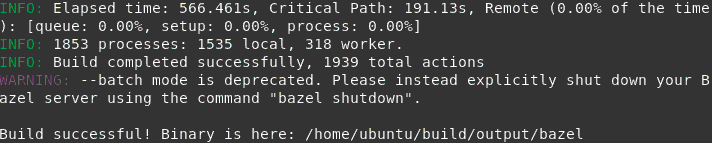

<center></center>

<br>

Bazel is a free software tool that allows for the automation of building and testing of software. Similar to build tools like Make, Maven, and Gradle, Bazel builds software applications from source code using a set of rules.

It uses a human-readable, high-level build language. Bazel supports projects in multiple languages and builds outputs for multiple platforms and supports large codebases across multiple repositories, and large numbers of users.

In designing Bazel, emphasis has been placed on build speed, correctness, and reproducibility. The tool uses parallelization to speed up parts of the build process. It includes a Bazel Query language that can be used to analyze build dependencies in complex build graphs

Bazel must have Power support in the future, making its installation possible through community-supported methods. However, currently, if you want to install on Power or other architectures or systems that do not have support, you need compiling Bazel from source.

<div id="building">So let's see how to install Bazel on architectures and systems not officially supported. I will use Ubuntu 14.04 as the basis of this tutorial, but it can be easily adapted to other Linux systems.</div>

<br><br>

------------
# Building Bazel from scratch (bootstrapping)

Here we will see how to do self-compilation. If you are using Ubuntu 14.04 or Ubuntu 16.04 in ppc64le, you can skip right to: [Using ready binaries](#ready "Using ready binaries").

* **First, install the prerequisites:**  
Pkg-config  
Zip, Unzip  
G++  
Zlib1g-dev  
JDK 8 (you must install version 8 of the JDK. Versions other than 8 are not supported)  
Python (versions 2 and 3 are supported, installing one of them is enough)  

```
# add-apt-repository ppa:openjdk-r/ppa  
# apt-get update  
# apt-get install pkg-config zip unzip g++ zlib1g-dev openjdk-8-jdk python  
```

<br>  

* **Next, download the Bazel binary installer named bazel-<version>-dist.zip from the [Bazel releases page on GitHub](https://github.com/bazelbuild/bazel/releases):**  
  
```
  wget https://github.com/bazelbuild/bazel/releases/download/<version>/bazel-<version>-dist.zip
```
There is a single architecture-independent distribution archive. There are no architecture-specific or OS-specific distribution archives.

You have to use the distribution archive to bootstrap Bazel. You cannot use a source tree cloned from GitHub (the distribution archive contains generated source files that are required for bootstrapping and are not part of the normal Git source tree).

<br>

* **Unpack the zip file somewhere on disk:**

```
  unzip bazel-<version>-dist.zip
```

<br>

* **Run the compilation script:**

```
  bash ./compile.sh
```

<br>

*This may take several minutes...*

<br>

<div id="ready">And this should be the output:  </div> 



<br>

------------

# Using ready binaries

If you are using Ubuntu 14.04 or Ubuntu 16.04 in ppc64le, you can use our already compiled versions of the binaries.

Make sure you have the JDK 8 installed:  
```
  java -version
```

<br>

* **If you do not have it, you need to install it:**  
```
# add-apt-repository ppa:openjdk-r/ppa
# apt-get update
# apt-get install openjdk-8-jdk
```
We have released the last 10 versions of Bazel already compiled in this link: <https://oplab9.parqtec.unicamp.br/pub/ppc64el/bazel/>

<br>

* **Download the desired version:**
```
  wget https://oplab9.parqtec.unicamp.br/pub/ppc64el/bazel/ubuntu_<version>/bazel_bin_<version>
# mv bazel_bin_<version> bazel
# chmod +x bazel
```

<br>

------------

# Installing Bazel

Finally, the compiled output is placed into output/bazel (or it is in the current directory if you have downloaded the binary). This is a self-contained Bazel binary, without an embedded JDK. You can copy it anywhere or use it in-place. For convenience we recommend copying this binary to a directory that's on your PATH (such as /usr/local/bin on Linux).  
```
# mv output/bazel /usr/local/bin
```
or  
```
# mv bazel /usr/local/bin
```

<br>

When using Bazel for the first time, it will extract the installation and prepare everything. To do this, simply use the command:  
```
```

<br>

From now on, Bazel is installed and to use it simply use the command:
```
  bazel <command> <options>
```

<br>

------------

# Using Bazel to compile Bazel

Once installed, you can use Bazel itself to compile a new version. To do this, simply download the desired version (as seen in [Building Bazel from scratch](#building "Building Bazel from scratch")) or even the developing version on [GitHub](https://github.com/bazelbuild/bazel) and use the following command in the directory of the downloaded files:
```
  Bazel build //src:bazel
```

<br>

------------

### References  
* <https://docs.bazel.build/>
<br>
------------

*Written by [Gustavo Salibi](https://github.com/gsalibi).*
