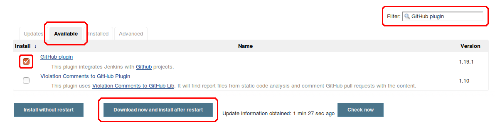
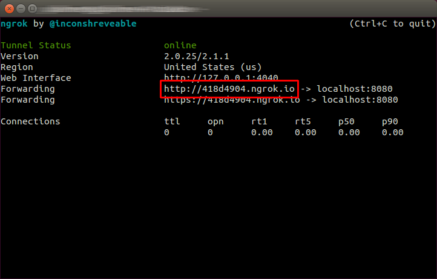
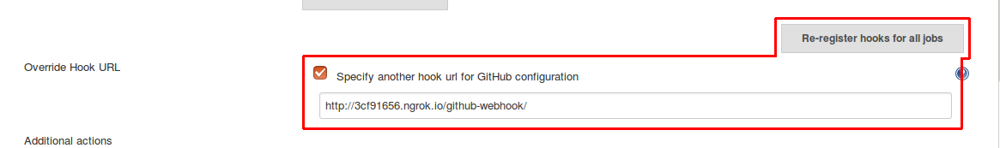

Continuous integration allows code to be tested automatically every time it’s changed, detecting errors as early as possible. In this tutorial a CI using a GitHub repository will be approached.

# Step 1: Installing and setting up Jenkins and Git
To install Jenkins execute the following commands:

	wget -q -O - https://jenkins-ci.org/debian/jenkins-ci.org.key | sudo apt-key add -
	sudo sh -c 'echo deb http://pkg.jenkins-ci.org/debian-stable binary/ > /etc/apt/sources.list.d/jenkins.list'
	sudo apt-get update
	sudo apt-get install Jenkins

To install git, simply execute:

	sudo apt-get install git

Access Jenkins through http://localhost:8080 and install the GitHub plugin. To do this go to **Manage Jenkins** → **Manage Plugins** → **Available** and search for the **GitHub plugin**. Press **Download now and install after restart** and check **Restart Jenkins when installation is complete and no jobs are running** in the installation screen. All the dependent plugins will be also installed.

# Step 2: Creating a job

In Jenkins dashboard, click on **New Item**, give your project a name (e.g. Your repository name at Github), and select **Freestyle project**.

At the subsequently settings page that opens, check **GitHub project** and enter the GitHub URL of the project. Use the format https://github.com/YOUR-USERNAME/YOUR-REPOSITORY

In source code management section, choose **Git** and enter the repository URL the same way as above.

Under **Build Triggers** check **Build when a change is pushed to GitHub**

Following, add a build step selecting **Execute Shell** and enter the shell script required to build the code and running a test on it. The test input and expected output must be in the repository.

# Step 3: Configuring GitHub plugin

Go to **Manage Jenkins** → **Configure System** → **GitHub** section → **Advanced** → **Manage additional GitHub Actions** → **Convert login and password to token**

A new sub-section will appear right above.

Select **From login and password**, fill your login and password from GitHub and press **Create token credentials**

Above this sub-section, click **Add GitHub server**. Keep the **API URL** unchanged.

Under **Credentials** dropdown menu, select the token just created and test your connection. If everything works fine, don't leave this screen yet and follow to step 4.

# Step 4: Changing GitHub POST URL

As Jenkins is running local and not accessible from the internet, a tunnel must be created to allow GitHub to deliver POST requests.

Download [ngrok](https://ngrok.com/download), unzip and run using:

	$ ./ngrok http 8080

Ngrok will generate a URL accessible from the internet that forwards to port 8080 of localhost.

Do not close the terminal window, otherwise the URL will stop working.

Check **Specify another hook url for GitHub configuration** under **Override Hook URL** and change the http://localhost:8080 part of the URL for the URL generated by Ngrok.

It should look like http://92832de0.ngrok.io/github-webhook/

Press **re-register hooks for all jobs** and then **Save**.

# Step 5: Testing it

Try to edit a file in the GitHub repository. You should be able to see a new Build under the Build history panel at the left of the screen.

Try also changing the files in a way that should make the build fail, such as changing the expect output of the test.
