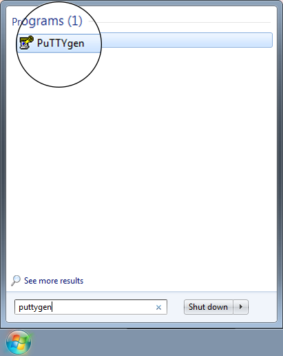
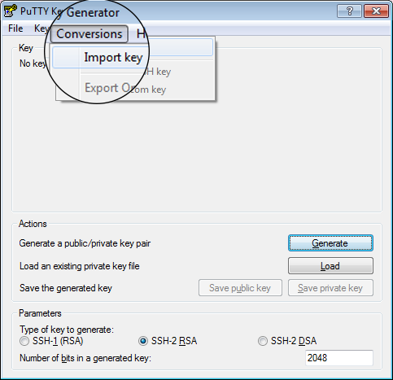
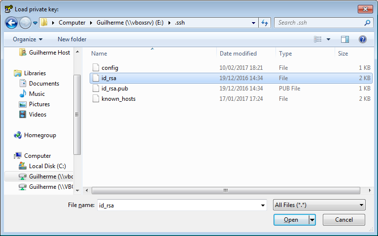
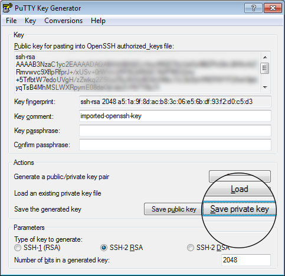
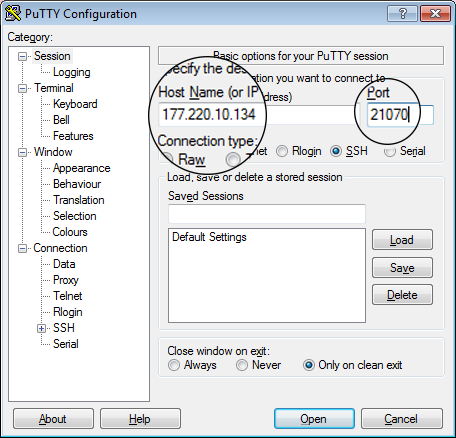
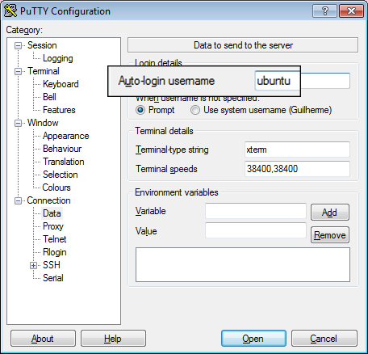
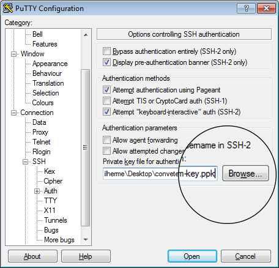
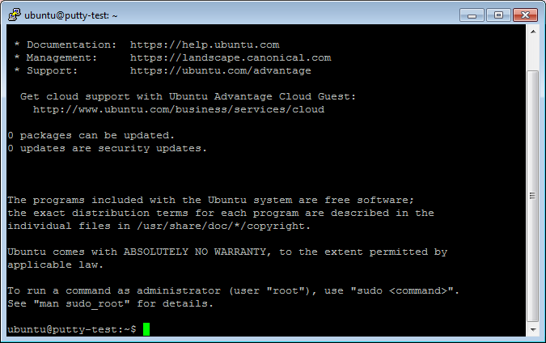

# Step 1: Converting a .pem key into a .ppk key

When installing PuTTY, the key generator PuTTYgen will also be installed. Open **PuTTYgen** → **Conversions** menu → **Import key**

 

Load your .pem key file and click **Save private key**. Click **Yes** in the warning. Save it wherever suits you.

# Step 2: Connecting to the Machine

After launching an instance and associating a floating IP to it, convert the IP to a port as seen [here](http://177.220.10.134/blog/minicloud-tutorial.html#3-accessing-our-virtual-machine).

Now open PuTTY and fill the login info:

In **Session** category, host name is 177.220.10.134 and port is calculated based on the floating IP.

In **Connection**→**Data**, fill **Auto-login username** with the name of the distribution of the machine: ubuntu, fedora, centos or debian.

In **Connection**→**SSH**→**Auth** click **Browse...** and load the .ppk file created in Step 1

Click **Open** to connect to the machine. If it's the first time you are connecting to the machine using PuTTy, you should see a security alert. Click **Yes** and the terminal window will open.

