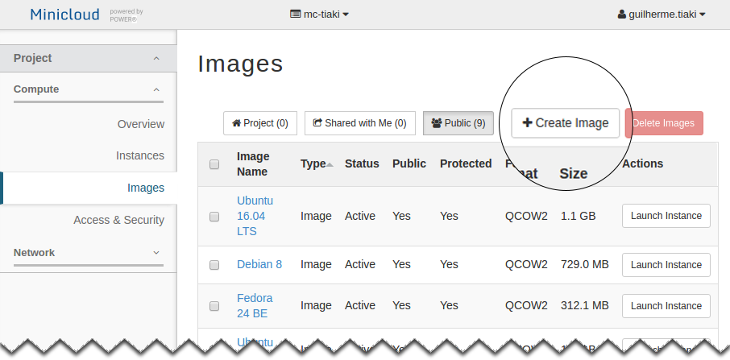
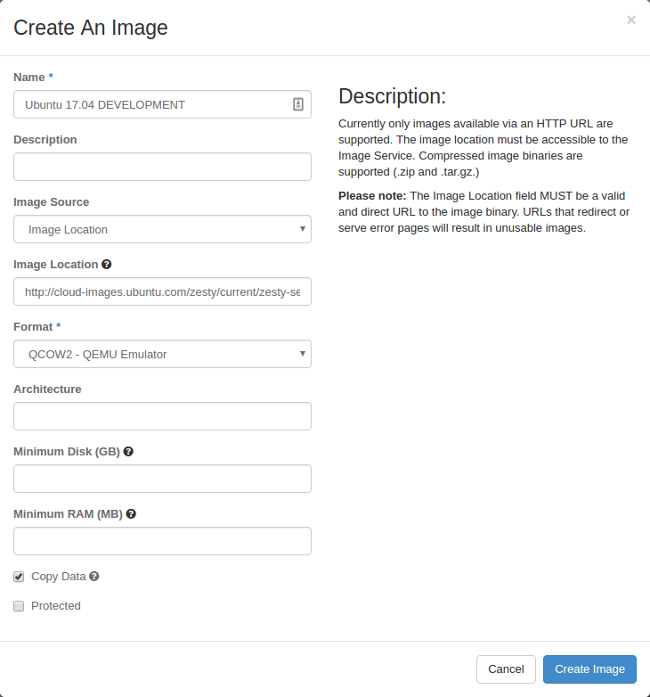
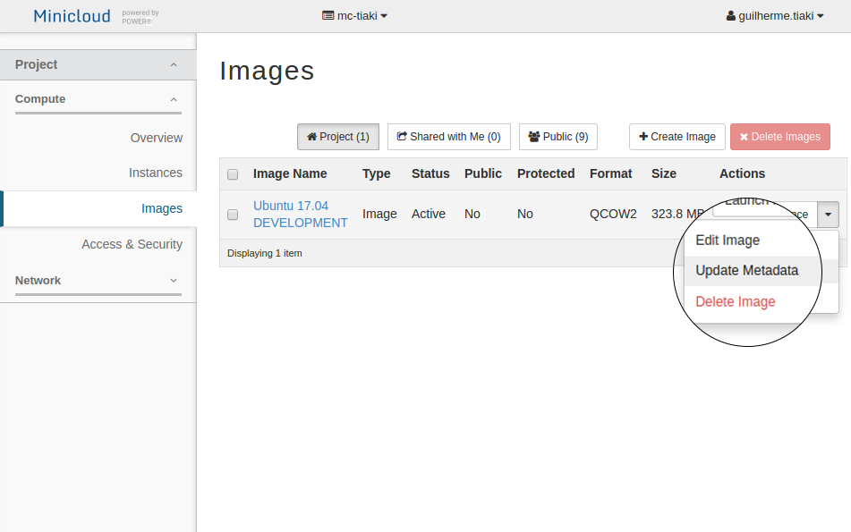
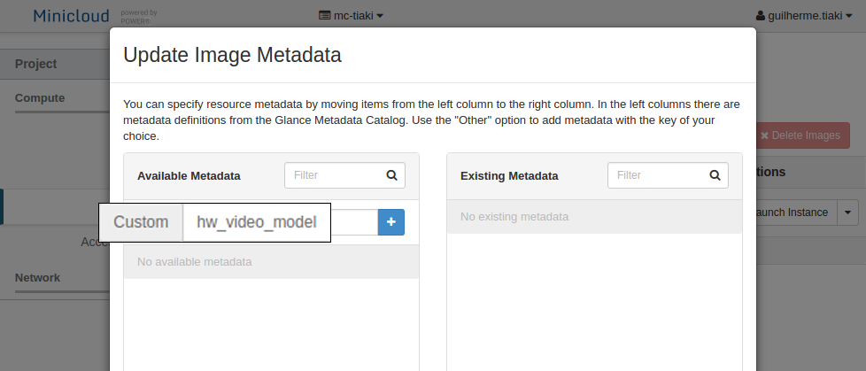
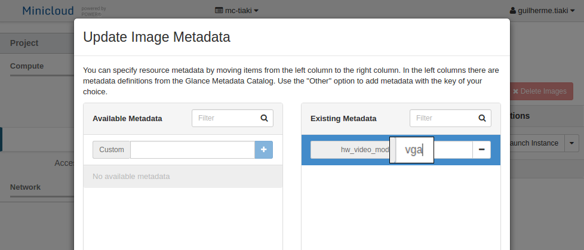

**Note: This feature is disabled by default, and may be enabled upon request.**

To add your own images to Minicloud, open the **Images** section in the dashboard and select **Create image**

Give it a name and optionally a description. To send the image file, it is possible browse and upload directly from your computer or provide an URL from which Minicloud can download it.

The **Format** is usually **QCOW2**. There is no need to fill the architecture. Choose a minimum RAM and Disk if necessary.

Confirm the image creation.

After the process finishes, choose **Update Metadata** and add the following property:

	hw_video_model

Attribute the following value to it:

	vga

You can now launch an instance as usual.

