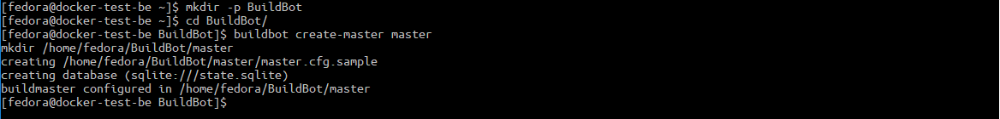
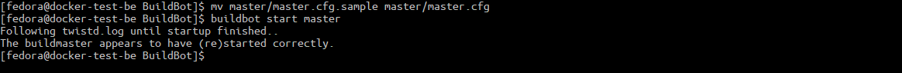
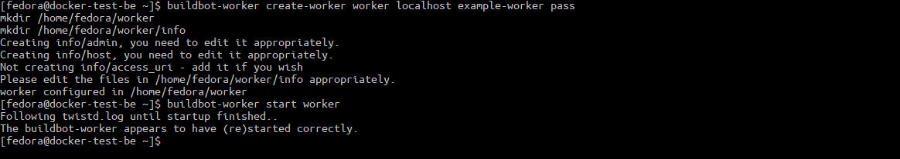
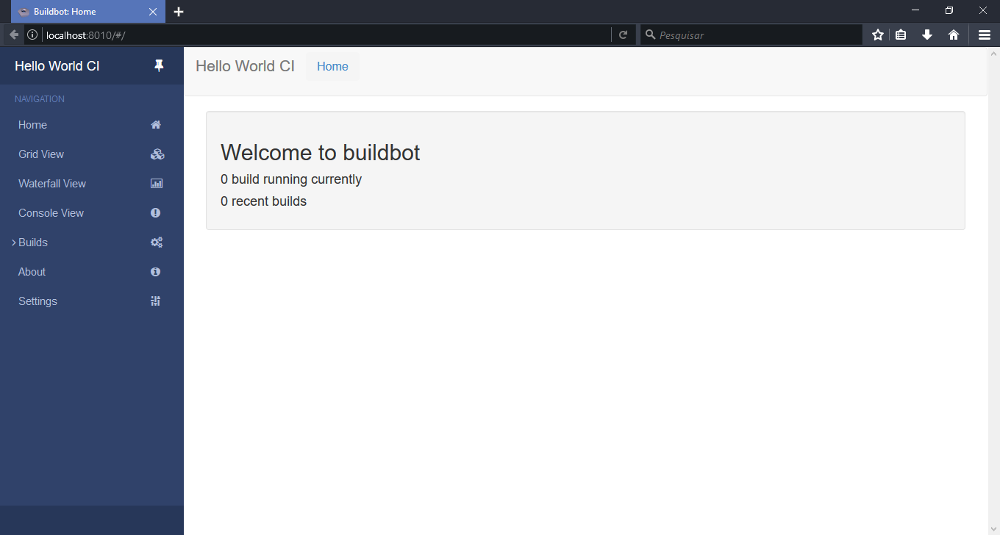

Buildbot its tool to automate compilation and tests. This tutorial we will install it on three important distro and run it. 

# 1 - Installation dependencies: 

- Installation of necessary packages to correct installation of Buildbot bundle. 
## Fedora 25:
``` bash
sudo dnf install python-devel python-pip redhat-rpm-config make gcc
```

## Fedora 26: 
```  bash
sudo dnf install python-pip redhat-rpm-config make gcc
```

## Ubuntu and Debian:
``` bash
sudo apt-get install Python-dev build-essential python-pip 
```   

# 2 - Installation without virtualenv: 
``` bash
sudo pip install --upgrade pip 
sudo pip install 'buildbot[bundle]' 
sudo pip install buildbot-grid-view 
sudo pip install buildbot-worker
sudo pip install setuptools-trial
```

# 2.5 - Installation with virtualenv (optional): 

- First we need install virtual environment. 

## Fedora: 
``` bash
sudo dnf install python-virtualenv 
```
## Ubuntu and Debian: 
``` bash
sudo apt install python-virtualenv 
```
-   Now we need activate the environment 

``` bash
virtualenv --no-site-packages YourSandbox
source YourSandbox/bin/activate
```

## Instalation: 
``` bash 
pip install --upgrade pip 
pip install 'buildbot[bundle]' 
pip install buildbot-grid-view 
pip install buildbot-worker 
pip install setuptools-trial
```

# 3- Initial Master setup: 
- Creation of folder where Buildbot archives will stay: 
    
``` bash
mkdir -p BuildBot 
cd BuildBot 
```

-   Creation of Master with name`[master]`: 
``` bash
buildbot create-master master 
```

    
-   The configuration of all functions of Buildbot its done in configuration file inside Master folder, to simplify we will use the sample configuration file provided in default template of Master `[master.cfg.sample]`, but it’s needed be renamed to `[master.cfg]` to be recognized by Buildbot: 
    
```bash
mv master/master.cfg.sample master/master.cfg 
```
-   Here we will start Master daemon: 
```bash
buildbot start master 
```


# 4- Initial Worker setup: 

- Here we will create a worker (previously slave) with name `[worker]`:
```bash
buildbot-worker create-worker worker localhost example-worker pass 
```


## The command syntax: 

    * buildbot-worker = Buildbot Worker program. 
    * create-worker = Command to creation of Worker
    * worker = Name of worker folder 
    * localhost = Master location on the network (This example Master are in the same VM)
    * example-worker = Name of worker 
    * pass = Authentication password 

-   Start of worker daemon: 
```bash
    buildbot-worker start worker 
```

-   Access address [http://localhost:8010/](http://localhost:8010/) on your browser.


