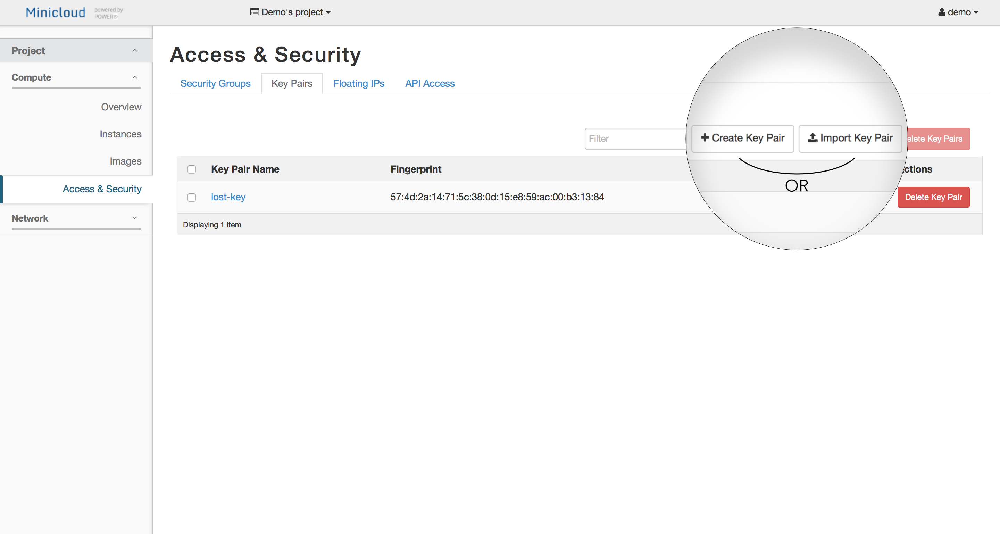
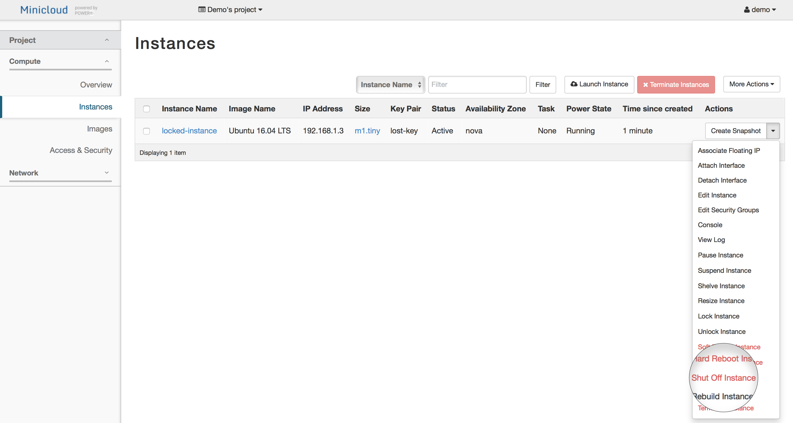
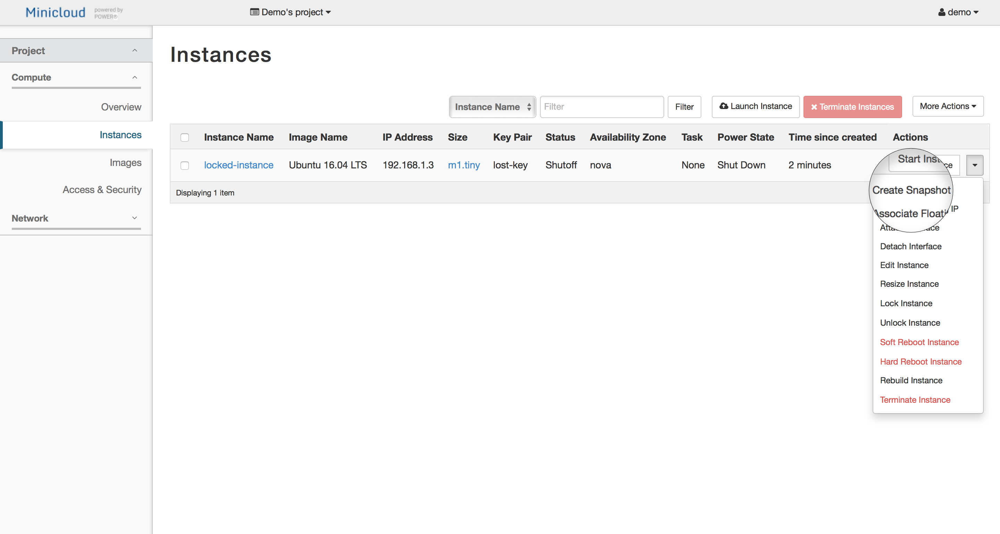
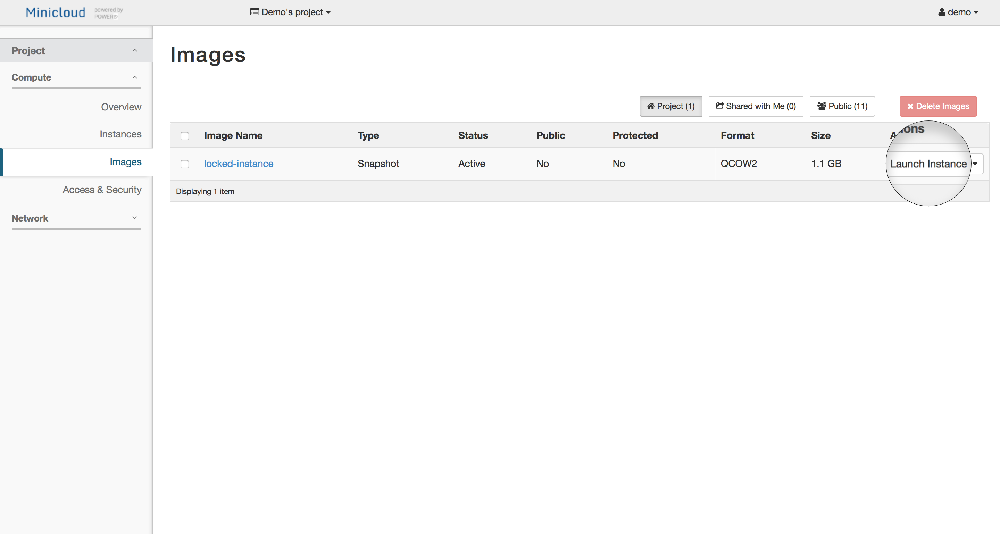
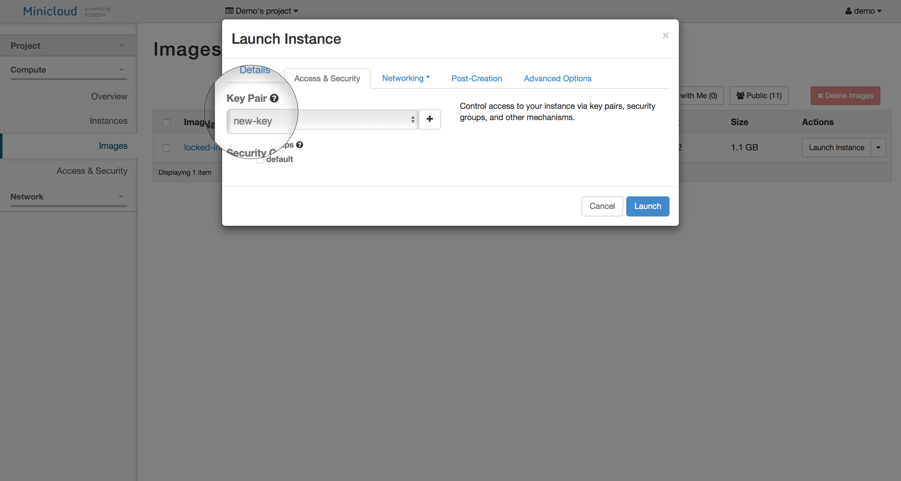

If you lost your private key, there is no way to recover it, however, you can still access your instances by assigning a new key to it

First, creste a new key (either importing or creating a new one directly)

Then, shut off your inaccessible instance

Now, create a snapshot of it

Using the snapshot as image, launch a new instance, and select the newly created key.

Now you can [connect to the new instance as usual](./minicloud-tutorial.html#3-accessing-our-virtual-machine). The username remains the same as before.