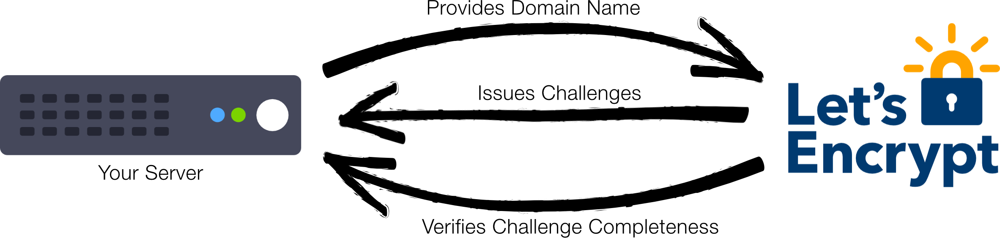

Deploying HTTPS is essential for security, and OpenStack Ansible does it by default. However, if no certificates are provided, it will generate self-signed ones, which although are more secure than no SSL at all, it will trigger a warning when accessing the dashboard in the browser. Luckily, the Let’s Encrypt project provides signed SSL certificates for free.

Let’s Encrypt requires your server to be validated before issuing the certificate. This means it will create a temporary file in your server and then try to access it from their servers, to verify that you control the domain you're trying to get a certificate to.

It can launch a temporary web server to do so, however, this will require to stop your usual web server (e.g. Apache) and lead to a few seconds of downtime. Alternatively, you can provide your web root path. Let’s Encrypt will create the files there, and they will be served directly by your usual web server. This approach does not lead to downtime, but presents some additional challenges when using it with OpenStack Ansible:

1. OpenStack Ansible does not have a web root path out of the box to be used by Let’s Encrypt.
2. SSL certificates must be provided to HAProxy, which runs on metal, while the Apache server to be used by Let’s Encrypt runs inside a container.

# Installing OpenStack Ansible

Install OpenStack as usual, without providing any certificates. Self-signed ones will be therefore generated, and we will replace them later.

# Enable web root

We will not actually create a web root. Since Let’s Encrypt only requires writing on `your-domain.com/.well-known` directory, we will create an alias to the `.well-known` path.

Attach to the horizon container. Replace the container name accordingly to your setup. If you don’t know the name, run `lxc-ls | grep horizon` to get the container name.

    # lxc-attach -n infra1_horizon_container-XXXXXXXX

Add the following line to `/etc/apache2/sites-enabled/openstack-dashboard.conf`, inside the `<VirtualHost *:80>` tag
    
    Alias /.well-known /var/www/html/.well-known 

Restart the apache2 service:
    
    # service apache2 restart

Now, we can use `/var/www/html` as our web root, at least from the Let’s Encrypt Certbot point of view.

# Getting the certificates

Now install the Let’s Encrypt Certbot. The intention is to only get the certificates files, not configure them in Apache. Use the following commands to do so:

    # apt-get update
    # apt-get install software-properties-common
    # add-apt-repository ppa:certbot/certbot
    # apt-get update
    # apt-get install certbot 
    # certbot certonly

When asked to choose an authetication method, choose `2`

<pre>How would you like to authenticate with the ACME CA?
-------------------------------------------------------------------------------
1: Spin up a temporary webserver (standalone)
2: Place files in webroot directory (webroot)
-------------------------------------------------------------------------------
Select the appropriate number [1-2] then [enter] (press &#39;c&#39; to cancel): <strong>2</strong>
</pre>

When asked for the webroot, input `/var/www/html`

<pre>Select the webroot for your-domain.com:
-------------------------------------------------------------------------------
1: Enter a new webroot
-------------------------------------------------------------------------------
Press 1 [enter] to confirm the selection (press &#39;c&#39; to cancel): 1
Input the webroot for unicamp.br: (Enter &#39;c&#39; to cancel): <strong>/var/www/html</strong>
</pre>

After this, the certificate files will be placed on `/etc/letsencrypt/live/your-domain.com`

# Allow the container to copy files to the host

Generate an SSH key **inside the container**:

    ssh-keygen -t rsa

Print the public key and copy it to the clipboard:

    cat /root/.ssh/id_rsa.pub

Now append the container's public key to the authorized_keys file **in the host**:

    echo [PASTE THE COPIED KEY HERE] >> /root/.ssh/authorized_keys

This will allow the container to copy the certificates to the host using `scp`.

# Applying the certificates in HAProxy

To use them in HAProxy, we must concatenate some files. Replace `your-domain.com` accordingly.

    # cat /etc/letsencrypt/live/your-domain.com/privkey.pem > /etc/letsencrypt/live/your-domain.com/haproxy.key
    # cat /etc/letsencrypt/live/your-domain.com/cert.pem /etc/letsencrypt/live/your-domain.com/chain.pem /etc/letsencrypt/live/your-domain.com/privkey.pem > /etc/letsencrypt/live/your-domain.com/haproxy.pem

Set the permissions properly:

    # chmod 640 /etc/letsencrypt/live/your-domain.com/haproxy.key
    # chmod 644 /etc/letsencrypt/live/your-domain.com/haproxy.pem

Still inside the horizon container, copy the files we just generated to the host. Replace `your-domain.com` and `HOST_IP_ADDRESS` accordingly.

    # scp /etc/letsencrypt/live/your-domain.com/haproxy.* HOST_IP_ADDRESS:/etc/ssl/private

Now **exit the container** and apply the new certificate:

    # service haproxy reload

# Renewing the certificates automatically

As Let’s Encrypt certificates are only valid for 90 days, it is highly advisable to schedule automatic renewing. We can do this using crontab inside the horizon container.

Attach to the horizon container. Replace the container name accordingly to your setup. If you don’t know the name, run `lxc-ls | grep horizon` to get the container name.

    # lxc-attach -n infra1_horizon_container-XXXXXXXX

Open the crontab editor:

    # crontab -e

Place this line at the end of the file, replacing `your-domain.com` and `HOST_IP_ADDRESS` accordingly.

    26 3 * * 5 certbot renew && cat /etc/letsencrypt/live/your-domain.com/privkey.pem > /etc/letsencrypt/live/your-domain.com/haproxy.key && cat /etc/letsencrypt/live/your-domain.com/cert.pem /etc/letsencrypt/live/your-domain.com/chain.pem /etc/letsencrypt/live/your-domain.com/privkey.pem > /etc/letsencrypt/live/your-domain.com/haproxy.pem && scp /etc/letsencrypt/live/your-domain.com/haproxy.* HOST_IP_ADDRESS:/etc/ssl/private && ssh HOST_IP_ADDRESS service haproxy reload

This will run every week, but it will only actually renew the certificate at most every 60 days, as only certificates that expire in less than 30 days are renewed. Running it more often than every 60 days makes it safer, as even if it fails to run once after the 60 days window, it will still run again before the certificate expire.