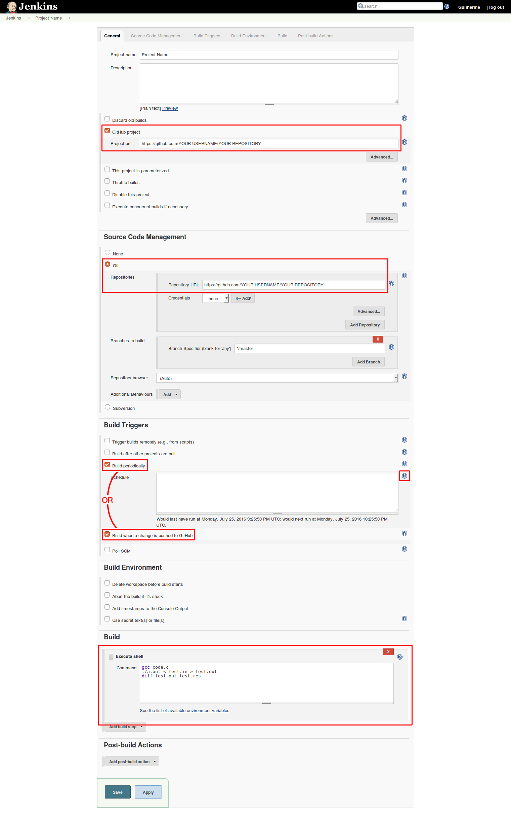
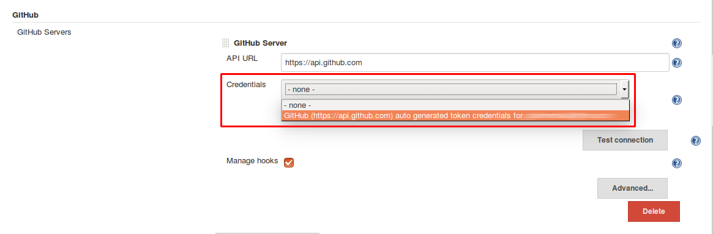
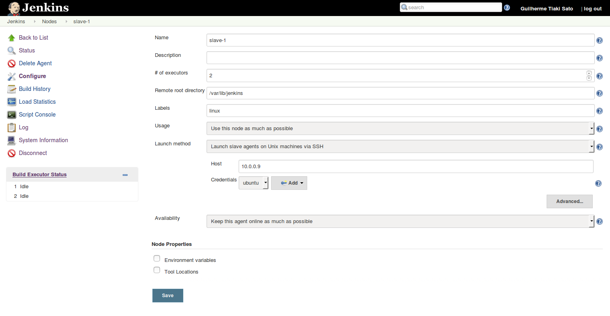

Continuous integration allows code to be tested automatically every time it’s changed, detecting errors as early as possible. In this tutorial a CI using a GitHub repository will be approached.

# Step 1: Installing and setting up Jenkins and Git

To install Jenkins, execute the following commands:

	wget -q -O - https://pkg.jenkins.io/debian/jenkins-ci.org.key | sudo apt-key add -
	sudo sh -c 'echo deb http://pkg.jenkins.io/debian-stable binary/ > /etc/apt/sources.list.d/jenkins.list'
	sudo apt-get update
	sudo apt-get install jenkins

To install git, simply execute:

	sudo apt-get install git

Access Jenkins through http://localhost:8080 and follow the instructions for the initial setup. Choose **Install suggested plugins** when asked.

# Step 2: Creating a job

In Jenkins dashboard, click on **New Item**, give your project a name and select **Freestyle project**.

You may choose **Discard old builds** in order to avoid using too much storage in the long term.

Check **GitHub project** and enter the GitHub URL of the project. Use the format *https://github.com/YOUR-USERNAME/YOUR-REPOSITORY*

In source code management section, choose **Git** and enter the repository URL the same way as above.

## Step 2.1: Choosing the build trigger

Under **Build Triggers** it is possible to choose to build periodically or when a change is pushed into GitHub. Although building only when GitHub changes is more efficient, it is required to your Jenkins server to be accessible through the internet, and the you must own the repository. Building periodically may waste resources, but it is simpler to configure.

### Step 2.1.1: Build Periodically

Check **Build Periodically** and define the period using the proper syntax found when clicking the **?**.

Complete the job creating by adding a build step (e.g. a shell script to compile and run a test) and jump to step 4

The test input and expected output should be in the repository.

### Step 2.1.2: Build when a change is pushed into GitHub

Check build when a change is pushed into GitHub

Complete the job creating by adding a build step (e.g. a shell script to compile and run a test) and follow to step 3

The test input and expected output should be in the repository.

# Step 3: Configuring GitHub plugin - Skip if building periodically

Go to **Manage Jenkins** → **Configure System** → **GitHub** section → **Advanced** → **Manage additional GitHub Actions** → **Convert login and password to token**

A new sub-section will appear right above.

Select **From login and password**, fill your login and password from GitHub and press **Create token credentials**

Above this sub-section, click **Add GitHub server**. Keep the **API URL** unchanged.

Under **Credentials** dropdown menu, select the token just created and test your connection.

# Step 4: Testing it

If using periodical build, click the **Build now** icon to test. If the test fails, check the console output to find the issue (e.g. missing compiler).

If using GitHub trigger, change a file in the repository. The build should start automatically in a few seconds.

#Step 5: Adding slave machines - Optional

As your projects grow, you may run out of resources in your machine. A possible solution is to add one or more slave machines, which will be responsible for building your projects, while the current machine will become the master and manage everything (the master will still be able to run jobs if desired).

The slave machine doesn't need Jenkins installed on it. There are many ways to connect the slave with the master, here, SSH will be used.

Install Java and Git in the slave using:

	sudo apt-get install default-jre
	sudo apt-get install git

Create a directory to be used by Jenkins, in this case will be the same path used by default in the master machine: /var/lib/jenkins

	sudo mkdir /var/lib/jenkins

Change the ownership of the directory to the same user used to login using SSH

	chown ubuntu:ubuntu /var/lib/jenkins

Back to the master machine:

Go to **Manage Jenkins** → **Manage Nodes** → **New Node**

Name your node and select **Permanent Agent**

The recommended **# of executors** is the number of cores in the slave machine

The **Remote root directory** is the path to the directory created.

If necessary to divide the slave machines into different groups, label them (e.g. the OS running in the machine, the CPU architecture)

The **Launch method** used here will be SSH, but other methods are also fine.

Simply enter your host and create a credential using your username and password, or username and private key.

Press **Save**

##Step 5.1: Restricting machines where projects can be run

If your slaves have different environments, your should restrict the machines where each project will run.

Under the **project** settings, check **Restrict where this project can be run** and type the machine name, use a label, or even use a more complex rule using logical operators (click the **?** for more information)

To prevent the master machine to run projects, go to **Manage Jenkins** → **Manage Nodes** → **master** → **Configure** → **# of executors** and set to 0.
