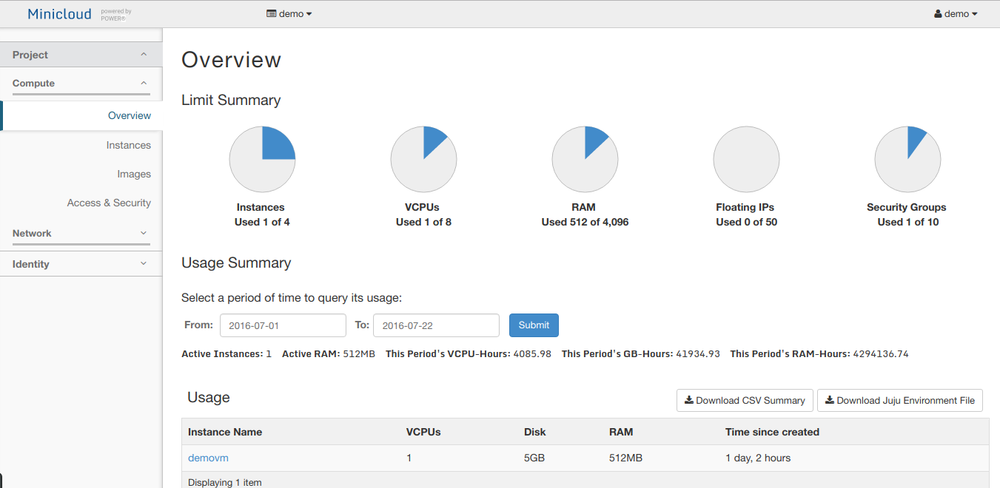
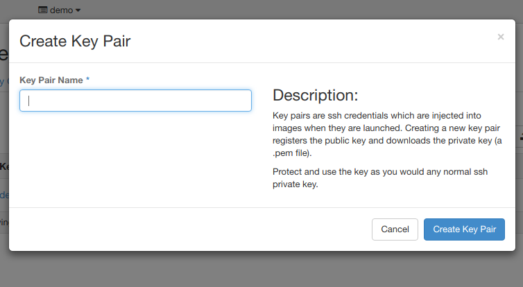
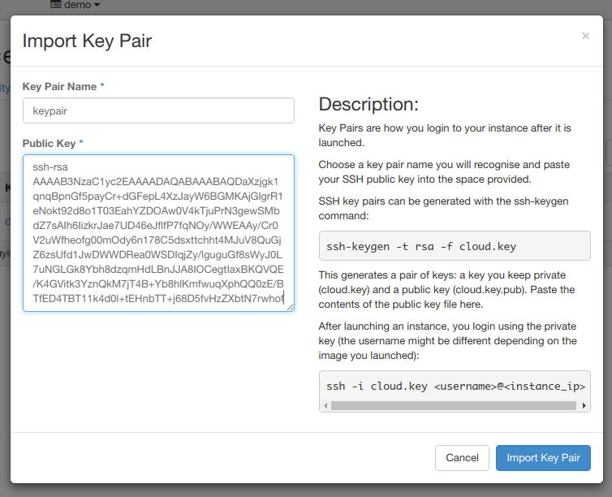
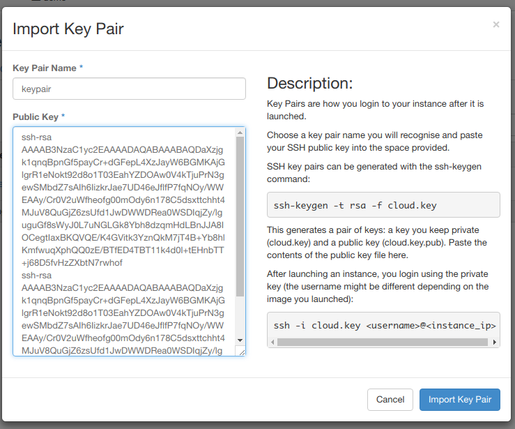
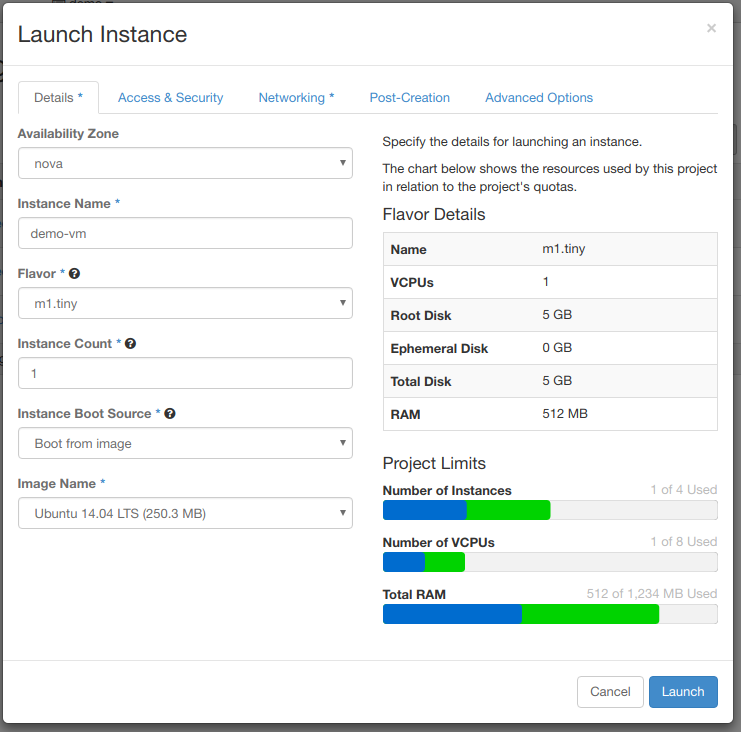
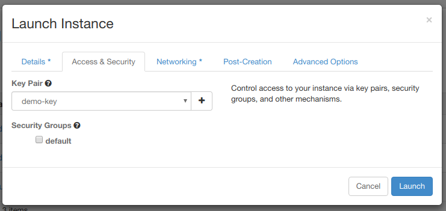
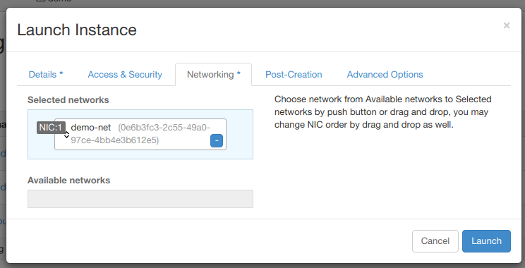
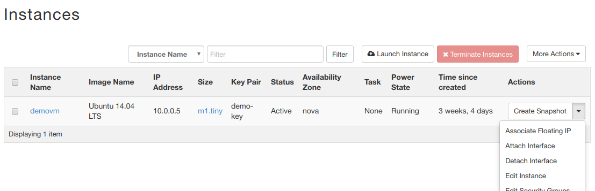
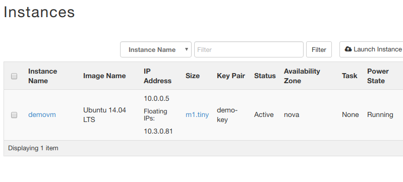

In this tutorial you'll learn all the basic steps to sucessfully create and login into a virtual machine in your minicloud account.

## 0. Overview

The first visible screen of our dashboard is the Overview. It shows all the relevant information of our project. The **Instances** tab shows our project's virtual machines. **Images** tab shows the available images to be used and **Access & Security** has project's security groups, public keys and firewall rules. Feel free to explore the remaining tabs.

## 1. Setting up Access & Security

First thing we have to do is adding our public key to our project. That way, when a virtual machine is created, our public key will be automatically added to it's authorized keys and we'll be able to login. It's a very simple process. In **Access & Security** tab, click on **Key Pairs**. You'll have two options: Import a key pair or create one.

### 1.1. Creating a Key Pair

Clicking on "Create Key Pair" will pop the screen below:

After typing a good name for your public key (easily identifiable), it will be downloaded to your machine in ***.pem** format. Remember to move it to a place easy to remember. By default, all public keys are stored at **~/.ssh**.

### 1.2. Importing an Existing Key Pair

If you choose to import an existing public key, you have to copy the contents of your ***.pub** key to the **Public Key** field.

Since is not possible to select multiple keys for a VM, you can add as many keys as you want in this field, and all of them will be valid when trying to login later.

## 2. Creating an Instance

Go to **Compute** and click on **Images** tab. Pick a image by clicking in it's respective **Launch a instance** button. In **Flavor** you can specify which kind of machine you want and in **Instance Count** you can specify the number of instances you want to create. In this example, we'll create one **m1.small** Ubuntu machine.  

In **Access & Security** tab we select which key pair will have access to the instance we're creating and select the **default** group. After selecting your key pair, go to **Network** tab.

Now drop to **Selected Networks** box all networks that you want your instance to be part of. Since we've created only one network, it'll be selected automatically.

**Post-Creation** and **Advanced Options** tabs are optional.

## 3. Accessing our virtual machine

In **Overview** you'll see that now our instance shows up. In **Actions**, click on the dropdown menu and select **Associate Floating IP**.

Now, to access our instance by SSH, we need to get the last digits of our floating IP address and sum 20000. This is the port we'll use to connect.

So, in the above example, we would connect with:

    ssh ubuntu@177.220.10.134 -p 20081

For Fedora and CentOS, use respectively:

	ssh fedora@177.220.10.134 -p 20081

<!>

	ssh centos@177.220.10.134 -p 20081