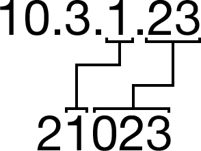

In this tutorial you'll learn all the basic steps to sucessfully create and login into a virtual machine in your minicloud account.

## 0. Overview

The first visible screen of our dashboard is the Overview. It shows all the relevant information of our project. The **Instances** tab shows our project's virtual machines. **Images** tab shows the available images to be used and **Access & Security** has project's security groups, public keys and firewall rules. Feel free to explore the remaining tabs.

## 1. Setting up Access & Security

First thing we have to do is adding our public key to our project. That way, when a virtual machine is created, our public key will be automatically added to it's authorized keys and we'll be able to login. It's a very simple process. In **Access & Security** tab, click on **Key Pairs**. You'll have two options: Import a key pair or create one.

### 1.1. Creating a Key Pair

Clicking on "Create Key Pair" will pop the screen below:

After typing a good name for your public key (easily identifiable), it will be downloaded to your machine in **\*.pem** format. Remember to move it to a place easy to remember. By default, all public keys are stored at **~/.ssh**.

### 1.2. Importing an Existing Key Pair

If you choose to import an existing public key, you have to copy the contents of your **\*.pub** key to the **Public Key** field.

Since is not possible to select multiple keys for a VM, you can add as many keys as you want in this field, and all of them will be valid when trying to login later.

## 2. Creating an Instance

Go to **Compute** and click on **Images** tab. Pick a image by clicking in it's respective **Launch a instance** button. In **Flavor** you can specify which kind of machine you want and in **Instance Count** you can specify the number of instances you want to create. In this example, we'll create one **m1.tiny** Ubuntu machine.  

In **Access & Security** tab we select which key pair will have access to the instance we're creating and select the **default** group. After selecting your key pair, go to **Networking** tab.

Now drop to **Selected Networks** box all networks that you want your instance to be part of. Since we've created only one network, it'll be selected automatically.

**Post-Creation** and **Advanced Options** tabs are optional.

## 3. Accessing our virtual machine

In **Instances** you'll see that now our instance shows up. In **Actions**, click on the dropdown menu and select **Associate Floating IP**.

The associated IP address will be shown.

To access the virtual machine via SSH, if the associated IP is 10.3.w.xyz, we'll use the port 2wxyz.

**After associating an IP, wait 5 minutes before connecting via SSH**

So, in the above example, we would connect with:
	
	ssh ubuntu@177.220.10.134 -p 21023

For other OSs, change the username accordingly:

<table style="width:100%">
  <tr>
    <th>Image(s)</th>
    <th>Command</th>
  </tr>
  <tr>
    <td>CentOS</td>
    <td>
<pre>ssh centos@177.220.10.134 -p 21023</pre>
</td>
  </tr>
  <tr>
    <td>Debian</td>
    <td>
<pre>ssh debian@177.220.10.134 -p 21023</pre>
</td>
  </tr>
  <tr>
    <td>Fedora</td>
    <td>
<pre>ssh fedora@177.220.10.134 -p 21023</pre>
</td>
  </tr>
</table>
